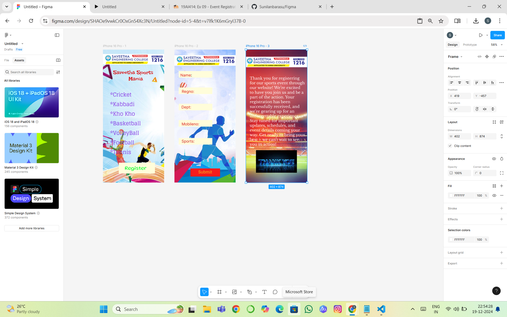
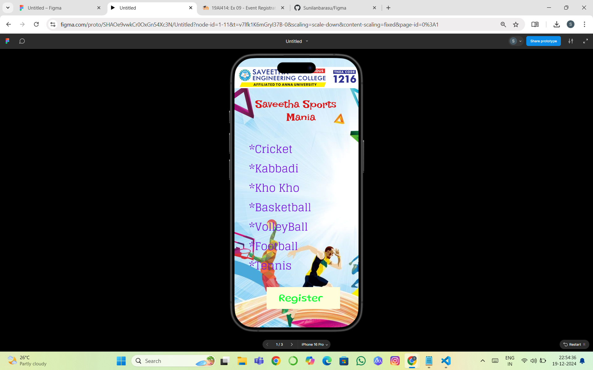
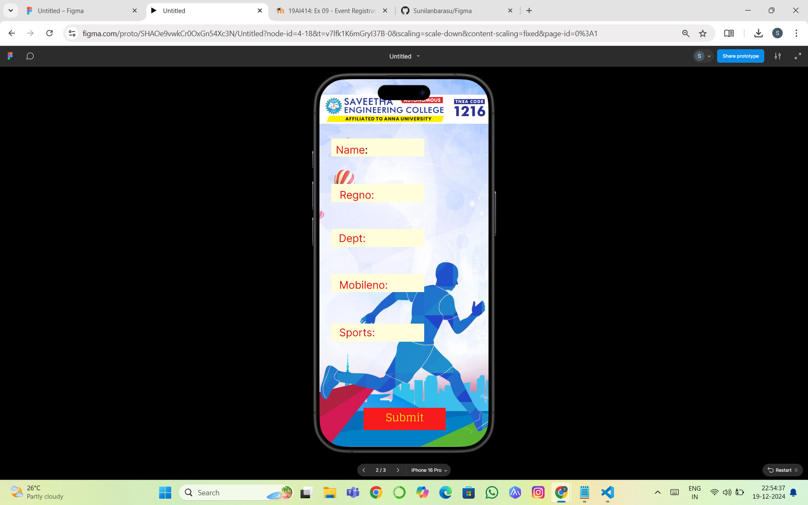

# Ex09 Event Registration Web Application
## Date:19-12-24

## AIM:
To design, develop and deploy a web application for event registration.

## DESIGN STEPS:

### Step 1:
Create a new frame.

### Step 2:
Select any one preset size of your choice.

### Step 3:
Select the shapes you need.

### Step 4:
Import images as needed.

### Step 5:
Create pages based on your need and link them.

### Step 6:

Validate the HTML and CSS code.

### Step 6:

Publish the website in the given URL.

## DESIGN TOOL:
Figma

## CODE:


```
home page


<div class="text--0-">
  Saveetha Sports <br />
  Mania
</div>
<div class="text--0-">
  *Cricket<br />*Kabbadi<br />*Kho Kho<br />*Basketball<br />*VolleyBall<br />*Football<br />*Tennis<br />
</div>
<svg
  width="221"
  height="43"
  viewBox="0 0 221 43"
  fill="none"
  xmlns="http://www.w3.org/2000/svg"
>
  <rect width="221" height="43" fill="#FFFDDA"></rect></svg
><svg
  width="221"
  height="43"
  viewBox="0 0 221 43"
  fill="none"
  xmlns="http://www.w3.org/2000/svg"
>
  <rect width="221" height="43" fill="#FFFDDA"></rect></svg
><svg
  width="221"
  height="43"
  viewBox="0 0 221 43"
  fill="none"
  xmlns="http://www.w3.org/2000/svg"
>
  <rect width="221" height="43" fill="#FFFDDA"></rect></svg
><svg
  width="221"
  height="43"
  viewBox="0 0 221 43"
  fill="none"
  xmlns="http://www.w3.org/2000/svg"
>
  <rect width="221" height="43" fill="#FFFDDA"></rect></svg
><svg
  width="221"
  height="43"
  viewBox="0 0 221 43"
  fill="none"
  xmlns="http://www.w3.org/2000/svg"
>
  <rect width="221" height="43" fill="#FFFDDA"></rect>
</svg>
<div class="text--0-">Name:</div>
<div class="text--0-">Regno:</div>
<div class="text--0-">Dept:</div>
<div class="text--0-">Mobileno:</div>
<div class="text--0-">Sports:</div>

<div class="text--0-">
  Thank you for registering for our sports event through our website! We’re
  excited to have you join us and be a part of the action. Your registration has
  been successfully received, and we’re gearing up for an unforgettable
  experience. Stay tuned for important updates, schedules, and event details
  coming your way. Get ready to bring your best – we can’t wait to see you in
  action!
</div>


First page


<div class="text--0-">
  Saveetha Sports <br />
  Mania
</div>
<div class="text--0-">
  *Cricket<br />*Kabbadi<br />*Kho Kho<br />*Basketball<br />*VolleyBall<br />*Football<br />*Tennis<br />
</div>


second page

<div class="container--0-">
  <svg
    width="221"
    height="43"
    viewBox="0 0 221 43"
    fill="none"
    xmlns="http://www.w3.org/2000/svg"
  >
    <rect width="221" height="43" fill="#FFFDDA"></rect></svg
  ><svg
    width="221"
    height="43"
    viewBox="0 0 221 43"
    fill="none"
    xmlns="http://www.w3.org/2000/svg"
  >
    <rect width="221" height="43" fill="#FFFDDA"></rect></svg
  ><svg
    width="221"
    height="43"
    viewBox="0 0 221 43"
    fill="none"
    xmlns="http://www.w3.org/2000/svg"
  >
    <rect width="221" height="43" fill="#FFFDDA"></rect></svg
  ><svg
    width="221"
    height="43"
    viewBox="0 0 221 43"
    fill="none"
    xmlns="http://www.w3.org/2000/svg"
  >
    <rect width="221" height="43" fill="#FFFDDA"></rect></svg
  ><svg
    width="221"
    height="43"
    viewBox="0 0 221 43"
    fill="none"
    xmlns="http://www.w3.org/2000/svg"
  >
    <rect width="221" height="43" fill="#FFFDDA"></rect></svg
  ><svg
    width="195"
    height="53"
    viewBox="0 0 195 53"
    fill="none"
    xmlns="http://www.w3.org/2000/svg"
  >
    <rect width="195" height="53" fill="#F81B1B"></rect>
  </svg>
  <div class="text-0-1-8">Submit</div>
  <div class="text-0-1-9">Name:</div>
  <div class="text-0-1-10">Regno:</div>
  <div class="text-0-1-11">Dept:</div>
  <div class="text-0-1-12">Mobileno:</div>
  <div class="text-0-1-13">Sports:</div>
</div>

third page

<div class="container--0-">
  
  <div class="text-0-1-2">
    Thank you for registering for our sports event through our website! We’re
    excited to have you join us and be a part of the action. Your registration
    has been successfully received, and we’re gearing up for an unforgettable
    experience. Stay tuned for important updates, schedules, and event details
    coming your way. Get ready to bring your best – we can’t wait to see you in
    action!
  </div>
  
</div>

```


## OUTPUT:






.png>)

## RESULT:
The program to design, develop and deploy a web application for event registration is completed successfully.
